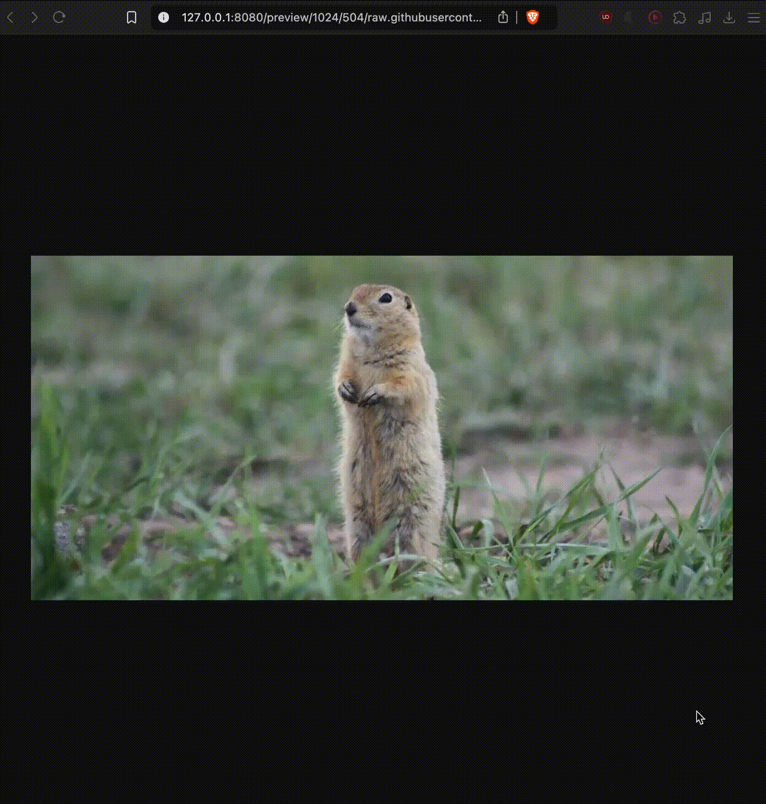

# Image previewer

The webservice to create image preview. Works with JPEG.

## Demo



## Run app

```bash
make run-img
```

The image previewer is running in localhost on port 8080.

## Usage

In browser go to `http://<SERVICE_HOST>:<SERVICE_PORT>/preview/<PREVIEW_WIDTH>/<PREVIEW_HEIGHT>/<LINK_TO_ORIGINAL_IMAGE>`

For example: [http://127.0.0.1:8080/preview/100/300/raw.githubusercontent.com/OtusGolang/final_project/master/examples/image-previewer/_gopher_original_1024x504.jpg](http://127.0.0.1:8080/preview/100/300/raw.githubusercontent.com/OtusGolang/final_project/master/examples/image-previewer/_gopher_original_1024x504.jpg)


## Run tests

```bash
make test
```

## Run linter

```bash
make lint
```