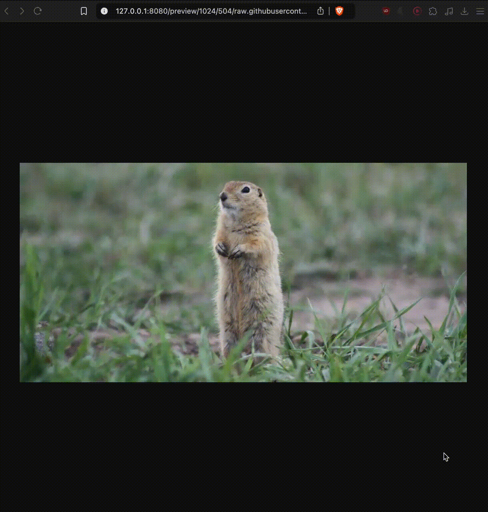

# Первьювер изображений

Веб-сервис, позволяющий создавать превью (уменьшенные копии) изображений из сети в формате jpeg.

## Демонстрация



## Запуск

```bash
make run-img
```

Веб-сервис на localhost на 8080 порту.

## Использование

В браузере перейти
по `http://<SERVICE_HOST>:<SERVICE_PORT>/preview/<PREVIEW_WIDTH>/<PREVIEW_HEIGHT>/<LINK_TO_ORIGINAL_IMAGE>`

Например [http://127.0.0.1:8080/preview/100/300/raw.githubusercontent.com/OtusGolang/final_project/master/examples/image-previewer/_gopher_original_1024x504.jpg](http://127.0.0.1:8080/preview/100/300/raw.githubusercontent.com/OtusGolang/final_project/master/examples/image-previewer/_gopher_original_1024x504.jpg)

* http://127.0.0.1:8080/ - адрес приложения,
* `preview/` - эндпоинт для создания превью,
* `100` и `300` - размер превью,
* `raw.githubusercontent.com/OtusGolang/final_project/master/examples/image-previewer/_gopher_original_1024x504.jpg` -
  ссылка на исходное изображение.

## Запуск тестов

```bash
make test
```

## Запуск линтера

```bash
make lint
```